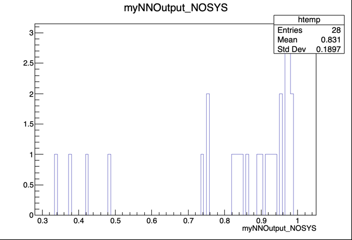

!!! abstract "In this session you will..."
    - set up your custom algorithm from a skeleton
    - load machine learning models via ONNX Runtime
    - compute the input variables and pass them to models
    - make predictions with the machine learning models and store them to the output ntuple

_For this part, we assume you're already familiar with the contents of ["Your first algorithm"](write_algorithm.md) and have followed the ["Initial setup"](setup.md) instructions._

## Running model inference

Many of the current machine learning solutions are based on python, which poses challenges for a typical ATLAS analysis. It is usually desirable to be able to run model inference in a different environment than the python-based training ecosystem, for example in C++. One such use case is to directly evaluate a trained model in the ntuple production framework such as the TopCPToolkit.

There are two solutions to evaluating a trained model in C++ that are easily accessible in ATLAS analysis code:
- Reading a trained model and evaluating it using the [lwtnn package](https://github.com/lwtnn/lwtnn) -- supports many architectures in Keras and scikit-learn.
- Converting a trained model to the ONNX (Open Neural Network Exchance) format, and then doing inference using [ONNX Runtime](https://onnxruntime.ai/) -- much larger support, community and backed by large companies. Support for much more machine learning libraries.

In this tutorial, we will focus on the latter case using ONNX Runtime to run inference on the trained models and store the model output to ntuples.

!!! note "What is ONNX Runtime?"
    [ONNX Runtime](https://onnxruntime.ai/) is an open-source library for both training and evaluating machine learning models. It is based on the open-source ONNX format and supports a large number of programming languages as well as various CPU/GPU/APU architectures.

    Many popular ML libraries have available converters to ONNX, which allow to store trained model in the .onnx format, which can then in turn be used by ONNX Runtime. A non-exhaustive list includes libraries such as: Keras, scikit-learn, pyTorch, XGBoost, ...

!!! tip "Convert models to the ONNX format"
    - For TensorFlow models, see [this tutorial](https://onnxruntime.ai/docs/tutorials/tf-get-started.html) using the [tf2onnx](https://github.com/onnx/tensorflow-onnx) tool.
    - For PyTorch models, see the ONNX Runtime tutorial [here](https://onnxruntime.ai/docs/tutorials/accelerate-pytorch/pytorch.html) and/or the PyTorch tutorial [here](https://pytorch.org/tutorials/beginner/onnx/export_simple_model_to_onnx_tutorial.html).
    - For other models, check out the list of ONNX Runtime tutorials [here](https://onnxruntime.ai/docs/tutorials/traditional-ml.html#convert-model-to-onnx).

For the purpose of simplifying model deployment and reducing code duplication, in TopCPToolkit we provide a `top::ONNXWrapper` base class that hides most of the ONNX Runtime APIs behind more convenient user interfaces. In this tutorial, we will implement an algorithm that loads a trained model and runs inference using `top::ONNXWrapper`.

!!! note
    Using ONNX Runtime APIs directly in your algorithm is still possible if needed. The ONNX Runtime library is always linked by default. Your algorithm needs to include the header `#include <onnxruntime_cxx_api.h>`. See the ONNX Runtime C/C++ API documentation [here](https://onnxruntime.ai/docs/api/c/) and examples [here](https://github.com/microsoft/onnxruntime-inference-examples/tree/main/c_cxx) for more information.

### Set up an algorithm skeleton

First, we need to have a custom algorithm that is responsible for
- applying event and object selections if necessary
- computing input tensors from the selected objects
- loading the trained ML models and running inference
- retrieving model outputs and writing them into the output ntuple

We will start from the skeleton provided by the [HowToExtendTopCPToolkit](https://gitlab.cern.ch/atlasphys-top/reco/HowToExtendTopCPToolkit/-/tree/master?ref_type=heads) package.

Assuming you have already set up TopCPToolkit following the ["Initial setup"](setup.md) steps, **under `TopCPToolkit/source/`**, install the *HowToExtendTopCPToolkit* package:
```
git clone ssh://git@gitlab.cern.ch:7999/atlasphys-top/reco/HowToExtendTopCPToolkit.git
```
Rename the package and algorithm to `TopMLTutorial` and `RunMyNN`, respectively:
```
source HowToExtendTopCPToolkit/scripts/rename_package.sh TopMLTutorial RunMyNN
```

### Load the ML model

The ML model we are going to use in this tutorial is taken from a previous TopWG [ML tutorial](https://topreco-tutorials.docs.cern.ch/MLTutorial2022/Intro/). The model is trained to perform binary classification on ttZ and WZ samples. The model has been already converted to the ONNX format named "model.onnx" and is shared in the gitlab repository [here](https://gitlab.cern.ch/atlasphys-top/reco/mlexamplesaver/-/blob/master/share/model.onnx). Let us download it and place it in `TopMLTutorial/share/`.

To include the model in our algorithm, we declare a `top::ONNXWrapper` object in the algorithm and construct it with the file path pointing to the model we just downloaded. We would also like to be able to configure the model paths via the config block.

!!! example "Exercise"
    Take a look at the [ONNXWrapper](https://gitlab.cern.ch/atlasphys-top/reco/TopCPToolkit/-/blob/main/source/TopCPToolkit/TopCPToolkit/ONNXWrapper.h?ref_type=heads) class definition. Add an ONNXWrapper object and the model path as members of our custom algorithm. We would also like to be able to configure the model paths via the config block.

??? tip "Hint"
    We want a vector of string for the model paths instead of a string, because the ONNXWrapper can load multiple trained models often necessary for cross-validation in order to prevent overtraining. One common use case is to apply the model trained using events with odd (even) event numbers only to events with even (odd) event numbers. In this tutorial, however, we will only load one model later for simplicity.

??? success "Solution"
    - In the header `TopMLTutorial/TopMLTutorial/RunMyNNAlg.h` include the ONNXWrapper header and declare the model and paths as private members:
      ```c++
      #include <vector>
      #include <string>
      #include "TopCPToolkit/ONNXWrapper.h"
      ...
        private:
          ...
          // NN model
          std::unique_ptr<ONNXWrapper> m_NN;
          std::vector<std::string> m_model_paths;
      ```

    - In `TopMLTutorial/Root/RunMyNNAlg.cxx`, inside the constructor `RunMyNNAlg::RunMyNNAlg`, add
      ```c++
        declareProperty("model_paths", m_model_paths, "A list of paths to the trained model");
      ```
      Inside `RunMyNNAlg::initialize()`, construct the ONNXWrapper object with the model paths:
      ```c++
        // initialize and load models
        m_NN = std::make_unique<ONNXWrapper>("myNN", m_model_paths);
      ```

    - In `TopMLTutorial/python/RunMyNNConfig.py`, add the option to set the model path with the default `["model.onnx"]` under `def __init__(self):` :
      ```python
          self.addOption('model_paths', ["model.onnx"], type=list)
      ```
      And pass the option to the algorithm under `def makeAlgs(self, config):` after the algorithm is created:
      ```python
          alg.model_paths = self.model_paths
      ```
      Also remove the `if config.dataType() is DataType.Data` block, because we would like to run this algorithm on both data and MC samples.

### Prepare the inputs

The input variables for this model are:
- `H_T`: scalar sum of $p_\mathrm{T}$ of all selected objects in an event
- `jet_1_pt`: $p_\mathrm{T}$ of the jet with the hightest $p_\mathrm{T}$
- `jet_2_pt`: $p_\mathrm{T}$ of the jet with the second hightest $p_\mathrm{T}$
- `lep_1_pt`: $p_\mathrm{T}$ of the lepton (electron or muon) with the hightest $p_\mathrm{T}$
- `lep_2_pt`: $p_\mathrm{T}$ of the lepton (electron or muon) with the second hightest $p_\mathrm{T}$
- `n_bjets`: number of jets
- `jet_1_twb`: pseudo continuous b-tagging score of the highest $p_\mathrm{T}$ jet
- `jet_2_twb`: pseudo continuous b-tagging score of the second highest $p_\mathrm{T}$ jet
- `bjet_1_pt`: $p_\mathrm{T}$ of the jet with the highest $p_\mathrm{T}$ among the b-tagged jets

To compute these input variables, we need electrons, muons, jets, and met.

!!! example "Exercise"
    Add and initialize the input handles. Add corresponding configurable options in the algorithm's config block as well.

??? success "Solution"
    - In `TopMLTutorial/TopMLTutorial/RunMyNNAlg.h`, add the following after the declaration of jet handle `CP::SysReadHandle<xAOD::JetContainer> m_jetsHandle m_jetsHandle`:
      ```c++
        CP::SysReadHandle<xAOD::ElectronContainer> m_electronsHandle {
          this, "myElectrons", "", "the input electron container"
        };
        CP::SysReadHandle<xAOD::MuonContainer> m_muonsHandle {
          this, "myMuons", "", "the input muon container"
        };
        CP::SysReadHandle<xAOD::MissingETContainer> m_metHandle {
          this, "myMet", "", "the input MET container"
        };

        std::string m_btagger;
      ```
      Also need to add the relevant headers in addition to the existing `#include <xAODJet/JetContainer.h>`:
      ```c++
      #include <xAODEgamma/ElectronContainer.h>
      #include <xAODMuon/MuonContainer.h>
      #include <xAODMissingET/MissingETContainer.h>
      ```

    - In `TopMLTutorial/Root/RunMyNNAlg.cxx`, initialize the handles in `RunMyNNAlg::initialize()`. Add the following after `ANA_CHECK(m_jetsHandle.initialize(m_systematicsList));`:
      ```c++
        ANA_CHECK(m_electronsHandle.initialize(m_systematicsList));
        ANA_CHECK(m_muonsHandle.initialize(m_systematicsList));
        ANA_CHECK(m_metHandle.initialize(m_systematicsList));
      ```
      Retrieve the object containers in `RunMyNNAlg::execute_syst(const CP::SystematicSet &sys)` in addition to `evtInfo` and `jets`:
      ```c++
        const xAOD::ElectronContainer *electrons = nullptr;
        const xAOD::MuonContainer *muons = nullptr;
        const xAOD::MissingETContainer *met = nullptr;

        ANA_CHECK(m_electronsHandle.retrieve(electrons, sys));
        ANA_CHECK(m_muonsHandle.retrieve(muons, sys));
        ANA_CHECK(m_metHandle.retrieve(met, sys));
      ```
      In the body of its contructor `RunMyNNAlg::RunMyNNAlg`, add:
      ```c++
        declareProperty("btagger", m_btagger, "B tagger name");
      ```

    - In `TopMLTutorial/python/RunMyNNConfig.py`, add the options for electron, muons, and met under `def __init__(self):`:
      ```python
          self.addOption('electrons', None, type=str, required=True)
          self.addOption('muons', None, type=str, required=True)
          self.addOption('met', None, type=str, required=True)
          self.addOption('btagger', 'GN2v01', type=str)
      ```
      And under `def makeAlgs(self, config):`, pass the config options to the algorithm after the algorithm is created, following `alg.myJets = config.readName(self.jets)`:
      ```python
          alg.myElectrons = config.readName(self.electrons)
          alg.myMuons = config.readName(self.muons)
          alg.myMet = config.readName(self.met)
          alg.btagger = self.btagger
      ```

Feel free to remove the code relevant for `m_rndNumberHandle`, `m_jptGeVHandle`, and `m_rngseed` in `RunMyNNAlg.h`, `RunMyNNAlg.cxx`, and `RunMyNNConfig.y`, as they are not needed here.

Now we are ready to compute the input variables for the model.

!!! example "Exercise"
    Compute the input variables.

??? success "Solution"
    First add the headers that we will need later in `TopMLTutorial/Root/RunMyNNAlg.cxx`:
    ```
    #include <AthContainers/ConstDataVector.h>
    #include "xAODBase/IParticleContainer.h"
    ```
    Inside the function `StatusCode RunMyNNAlg::execute_syst(const CP::SystematicSet &sys)`:
    ```c++
    StatusCode RunMyNNAlg::execute_syst(const CP::SystematicSet &sys) {

      ...

      float H_T = 0;

      ////
      // Jets are not necessarily sorted by pT
      // Sort them first
      auto sortedJets = std::make_unique<ConstDataVector<xAOD::JetContainer>>(jets->begin(), jets->end(), SG::VIEW_ELEMENTS);

      // xAOD::Jet inherits from xAOD::IParticle
      auto compare_pt = [](const xAOD::IParticle* p1, const xAOD::IParticle* p2) {
      return (p1->pt() > p2->pt());
      };

      std::sort(sortedJets->begin(), sortedJets->end(), compare_pt);

      // b-tagged jets
      auto btaggedJets = std::make_unique<ConstDataVector<xAOD::JetContainer>>(SG::VIEW_ELEMENTS);

      // loop over sorted jets
      for (const xAOD::Jet *jet : *sortedJets) {
        H_T += jet->pt();

        // b tag
        if (jet->isAvailable<int>("ftag_quantile_"+m_btagger+"_Continuous")) {
          if (jet->auxdataConst<int>("ftag_quantile_"+m_btagger+"_Continuous") > 1) {
            btaggedJets->push_back(jet);
          }
        }
      }

      int n_jets = jets->size();
      int n_bjets = btaggedJets->size();

      // require at least two jets and one b tag
      if (n_jets < 2 or n_bjets < 1) {
        return StatusCode::SUCCESS;;
      }

      float jet_1_pt = sortedJets->at(0)->pt();
      float jet_2_pt = sortedJets->at(1)->pt();
      float jet_1_twb = sortedJets->at(0)->auxdataConst<int>("ftag_quantile_"+m_btagger+"_Continuous");
      float jet_2_twb = sortedJets->at(1)->auxdataConst<int>("ftag_quantile_"+m_btagger+"_Continuous");

      float bjet_1_pt = btaggedJets->at(0)->pt();

      ////
      // Leptons
      auto leptons = std::make_unique<ConstDataVector<xAOD::IParticleContainer>>(SG::VIEW_ELEMENTS);

      for (const xAOD::Electron *electron : *electrons) {
        leptons->push_back(electron);
        H_T += electron->pt();
      }
      for (const xAOD::Muon *muon : *muons) {
        leptons->push_back(muon);
        H_T += muon->pt();
      }

      if (leptons->size() < 2) {
        return StatusCode::SUCCESS;;
      }

      // Sort by pT
      std::sort(leptons->begin(), leptons->end(), compare_pt);

      float lep_1_pt = leptons->at(0)->pt();
      float lep_2_pt = leptons->at(1)->pt();

      ////
      // Add MET
      H_T += (*met)["Final"]->met();

      // Convert MeV to GeV
      H_T /= 1000.;
      jet_1_pt /= 1000.;
      jet_2_pt /= 1000.;
      bjet_1_pt /= 1000.;
      lep_1_pt /= 1000.;
      lep_2_pt /= 1000.;

      ...

      return StatusCode::SUCCESS;
    }
    ```

### Make predictions and write to the output

The output of the model is a class probability between 0 and 1 for each event, with 1 being signal-like (ttZ) and 0 being background-like (WZ). We will decorate the model output to the event using `CP::SysWriteDecorHandle`.

!!! example "Exercise"
    Define and initialize the output handle for writing the model output.

??? success "Solution"
    - In `TopMLTutorial/TopMLTutorial/RunMyNNAlg.h`, define a private class member for `RunMyNNAlg`:
      ```c++
      CP::SysWriteDecorHandle<float> m_nnOutputHandle {
        this, "myNNOutput", "myNNOutput_%SYS%", "decoration name for the neural network output"
      };
      ```

    - In `TopMLTutorial/Root/RunMyNNAlg.cxx`, initialize `m_nnOutputHandle` in `StatusCode RunMyNNAlg::initialize()` after `m_eventInfoHandle` before `m_systematicsList`:
      ```c++
      // Initialize the NN output handle with the EventInfo handle
      ANA_CHECK(m_nnOutputHandle.initialize(m_systematicsList, m_eventInfoHandle));
      ```
      Also set the default value at the beginning of `RunMyNNAlg::execute_syst` after retrieving the input handles
      ```c++
        m_nnOutputHandle.set(*evtInfo, -1, sys);
      ```

    - In `TopMLTutorial/python/RunMyNNConfig.py`, add the output variable in `def makeAlgs(self, config):`
      ```python
          config.addOutputVar('EventInfo', 'myNNOutput_%SYS%', 'myNNOutput')
      ```

Now we are finally ready to run inference with the model and get the prediction.

!!! example "Exercise"
    Set model inputs, run inference, and retrieve the model output.

??? success "Solution"
    Add the following in `StatusCode RunMyNNAlg::execute_syst(const CP::SystematicSet &sys)` after calculating the input variables:
    ```c++
      ////
      // Add inputs
      // One input node with the shape 1 x 9: 1 batch and 9 features
      std::vector<int64_t> input_shapes {1, 9}; // a tensor of shape 1 x 9

      std::vector<float> input_values {
        H_T, jet_1_pt, jet_2_pt, lep_1_pt, lep_2_pt, static_cast<float>(n_bjets), jet_1_twb, jet_2_twb, bjet_1_pt
      };

      m_NN->clearInputs();
      m_NN->linkInputs(input_values, input_shapes);

      // Run inference
      m_NN->evaluate();

      // Get the output
      // The model has one output node
      float* pred = m_NN->getOutputs<float>(0);
      // Note: this is a pointer because the model output per node is an array that represents a tensor

      // Set the output handle
      m_nnOutputHandle.set(*evtInfo, *pred, sys);
    ```

### Run with the custom algortihm

Let's compile the code to include the custom algorithm we just implemented. From the directory `TopCPToolkit/source/`, go back to the project top directory and create a `build` and `run` directoies:
```
cd ..
mkdir -p build run
```
!!! note
    In case you have not already done that, first follow the steps in ["Initial setup"](setup.md) to set up the environment and compatible AnalysisBase release.

Compile
```
cd build
cmake ../source
make -j4
source */setup.sh
cd ..
```

The sample we are going to use is the MC20 nominal non-hadronic ttbar sample for Run 2 in the `DAOD_PHYS` format. Let's set it up in the `run` directory:
```
cd run
echo "/cvmfs/atlas.cern.ch/repo/sw/database/GroupData/dev/AnalysisTop/ContinuousIntegration/R22/MC/p6490/DAOD_PHYS.410470_r13145_p6490.pool.root.1" > input_ml.txt
```
The final piece before we can run is the config file. In particular, we would like to select events with at least two leptons and two jets so our model can output valid predictions. Replace the current content of `TopCPToolkit/source/TopMLTutorial/share/configs/TopMLTutorial/reco.yaml` with the following:

??? "reco.yaml"
    ```yaml
    CommonServices:
      systematicsHistogram: 'listOfSystematics'

    PileupReweighting: {}

    EventCleaning:
        runEventCleaning: True

    Jets:
      - containerName: 'AnaJets'
        jetCollection: 'AntiKt4EMPFlowJets'
        runNNJvtUpdate: True
        systematicsModelJES: 'Category'
        systematicsModelJER: 'Full'
        JVT: {}
        PtEtaSelection:
            minPt: 25000.0
            maxEta: 2.5
        FlavourTagging:
          - btagger: 'GN2v01'
            btagWP: 'FixedCutBEff_85'
          - btagger: 'GN2v01'
            btagWP: 'Continuous'
        FlavourTaggingEventSF:
          - containerName: 'AnaJets.baselineJvt'
            btagger: 'GN2v01'
            btagWP: 'FixedCutBEff_85'
          - containerName: 'AnaJets.baselineJvt'
            btagger: 'GN2v01'
            btagWP: 'Continuous'

    Electrons:
      - containerName: 'AnaElectrons'
        crackVeto: True
        IFFClassification: {}
        WorkingPoint:
          - selectionName: 'loose'
            identificationWP: 'TightLH'
            isolationWP: 'NonIso'
            noEffSF: True
          - selectionName: 'tight'
            identificationWP: 'TightLH'
            isolationWP: 'Tight_VarRad'
            noEffSF: True
        PtEtaSelection:
            minPt: 25000.0
            maxEta: 2.47
            useClusterEta: True

    Muons:
      - containerName: 'AnaMuons'
        IFFClassification: {}
        WorkingPoint:
          - selectionName: 'loose'
            quality: 'Medium'
            isolation: 'NonIso'
          - selectionName: 'tight'
            quality: 'Medium'
            isolation: 'Tight_VarRad'
            systematicBreakdown: True
        PtEtaSelection:
            minPt: 25000.0
            maxEta: 2.5

    MissingET:
      - containerName: 'AnaMET'
        # Format should follow Object: '<containerName>.<postfix>'
        jets: 'AnaJets'
        electrons: 'AnaElectrons.tight'
        muons: 'AnaMuons.tight'

    OverlapRemoval:
      inputLabel: 'preselectOR'
      outputLabel: 'passesOR'
      # Format should follow Object: '<containerName>.<postfix>'
      jets: 'AnaJets.baselineJvt'
      electrons: 'AnaElectrons.tight'
      muons: 'AnaMuons.tight'

    ObjectCutFlow:
      - containerName: 'AnaElectrons'
        selectionName: 'tight'
      - containerName: 'AnaMuons'
        selectionName: 'tight'
      - containerName: 'AnaJets'
        selectionName: 'baselineJvt'

    Thinning:
      - containerName: 'AnaJets'
        outputName: 'OutJets'
        selectionName: 'baselineJvt'
      - containerName: 'AnaElectrons'
        outputName: 'OutElectrons'
        selectionName: 'tight||loose'
      - containerName: 'AnaMuons'
        outputName: 'OutMuons'
        selectionName: 'tight||loose'

    Trigger:
        triggerChainsPerYear:
            '2018':
                - 'HLT_e26_lhtight_nod0_ivarloose || HLT_e60_lhmedium_nod0 || HLT_e140_lhloose_nod0'
                - 'HLT_mu26_ivarmedium || HLT_mu50'
        noFilter: False
        electrons: 'AnaElectrons.tight'
        electronID: 'Tight'
        electronIsol: 'Tight_VarRad'
        muons: 'AnaMuons.tight'
        muonID: 'Medium'

    EventSelection:
      - electrons: 'AnaElectrons.loose'
        muons: 'AnaMuons.loose'
        jets: 'AnaJets.baselineJvt'
        met: 'AnaMET'
        btagDecoration: 'ftag_select_GN2v01_FixedCutBEff_85'
        noFilter: False
        cutFlowHistograms: True
        selectionCutsDict:
          'dilep': |
            JET_N 25000 >= 2
            JET_N_BTAG >= 1
            SUM_EL_N_MU_N 25000 >= 2
            SAVE

    RunMyNN:
      - jets: 'AnaJets'
        electrons: 'AnaElectrons'
        muons: 'AnaMuons'
        met: 'AnaMET'
        btagger: GN2v01
        model_paths:
          - 'model.onnx'

    # After configuring each container, many variables will be saved automatically.
    Output:
      treeName: 'reco'
      vars: []
      metVars: []
      containers:
          # Format should follow: '<suffix>:<output container>'
          el_: 'OutElectrons'
          jet_: 'OutJets'
          met_: 'AnaMET'
          '': 'EventInfo'
      commands:
        # Turn output branches on and off with 'enable' and 'disable'
        - disable jet_.*_eff.*
        - disable jet_jvtEfficiency.*

    AddConfigBlocks:
      - modulePath: 'TopMLTutorial.RunMyNNConfig'
        functionName: 'RunMyNNConfig'
        algName: 'RunMyNN'
        pos: 'Output'
    ```

!!! example "Exercise"
    Run TopCPToolkit with 1000 events and without systematics. Inspect the output file and look for the branch storing the model output.

??? success "Solution"
    `runTop_el.py -i input_ml.txt -o output_ml -t TopMLTutorial -e 1000 --no-systematics`

    This produces an output file `output_ml.root`. The branch we created is named `myNNOutput_NOSYS` in the TTree `reco`. You can open the output file with ROOT and `reco->Draw("myNNOutput_NOSYS)`. This would produce a histogram:

    

### Complete examples

Below you can find the full source code of the algorithm and its config file.

??? "TopMLTutorial/TopMLTutorial/RunMyNNAlg.h"
    ```c++
    #ifndef RUNMYNN_H
    #define RUNMYNN_H

    #include <AnaAlgorithm/AnaAlgorithm.h>
    #include <SystematicsHandles/SysListHandle.h>
    #include <SystematicsHandles/SysReadHandle.h>
    #include <SystematicsHandles/SysWriteDecorHandle.h>

    #include <xAODEventInfo/EventInfo.h>
    #include <xAODJet/JetContainer.h>
    #include <xAODEgamma/ElectronContainer.h>
    #include <xAODMuon/MuonContainer.h>
    #include <xAODMissingET/MissingETContainer.h>

    #include "TopCPToolkit/ONNXWrapper.h"

    #include <vector>
    #include <string>

    namespace top {

      class RunMyNNAlg final : public EL::AnaAlgorithm {

      public:

        // Constructor
        RunMyNNAlg(const std::string &name, ISvcLocator *pSvcLocator);

        // initialize function: run once at the start of a job before event loop
        virtual StatusCode initialize() override;

        // execute function: run for each event and loop over all systematics
        virtual StatusCode execute() override;

        // finalize function: run once at the end of a job after event loop
        virtual StatusCode finalize() override { return StatusCode::SUCCESS; };

      private:

        StatusCode execute_syst(const CP::SystematicSet &sys);

        // Handle that registers a list of systematics
        CP::SysListHandle m_systematicsList {this};

        // Handles that retrieve systematically-varied object collections
        CP::SysReadHandle<xAOD::EventInfo> m_eventInfoHandle {
          this, "eventInfo", "EventInfo", "the input EventInfo container"
        };
        CP::SysReadHandle<xAOD::JetContainer> m_jetsHandle {
          this, "myJets", "", "the input jet container"
        };
        CP::SysReadHandle<xAOD::ElectronContainer> m_electronsHandle {
          this, "myElectrons", "", "the input electron container"
        };
        CP::SysReadHandle<xAOD::MuonContainer> m_muonsHandle {
          this, "myMuons", "", "the input muon container"
        };
        CP::SysReadHandle<xAOD::MissingETContainer> m_metHandle {
          this, "myMet", "", "the input MET container"
        };

        CP::SysWriteDecorHandle<float> m_nnOutputHandle {
          this, "myNNOutput", "myNNOutput_%SYS%", "decoration name for the neural network output"
        };

        std::string m_btagger;

        // NN model
        std::unique_ptr<ONNXWrapper> m_NN;
        std::vector<std::string> m_model_paths;
      };

    } // namespace top

    #endif
    ```

??? "TopMLTutorial/Root/RunMyNNAlg.cxx"
    ```c++
    #include "TopMLTutorial/RunMyNNAlg.h"

    #include <AthContainers/ConstDataVector.h>
    #include "xAODBase/IParticleContainer.h"

    namespace top {

      RunMyNNAlg::RunMyNNAlg(const std::string &name, ISvcLocator *pSvcLocator)
        : EL::AnaAlgorithm(name, pSvcLocator)
        {
          declareProperty("model_paths", m_model_paths, "A list of paths to the trained model");
          declareProperty("btagger", m_btagger, "B tagger name");
        }

      // initialize(): run once before the event loop
      StatusCode RunMyNNAlg::initialize() {
        // Initialize handles and variables
        ANA_CHECK(m_eventInfoHandle.initialize(m_systematicsList));
        ANA_CHECK(m_jetsHandle.initialize(m_systematicsList));
        ANA_CHECK(m_electronsHandle.initialize(m_systematicsList));
        ANA_CHECK(m_muonsHandle.initialize(m_systematicsList));
        ANA_CHECK(m_metHandle.initialize(m_systematicsList));

        // Initialize the NN output handle with the EventInfo handle
        ANA_CHECK(m_nnOutputHandle.initialize(m_systematicsList, m_eventInfoHandle));

        // Initialize systematics list handle
        ANA_CHECK(m_systematicsList.initialize());

        // initialize and load models
        m_NN = std::make_unique<ONNXWrapper>("myNN", m_model_paths);

        return StatusCode::SUCCESS;
      }

      // execute(): run for each event
      StatusCode RunMyNNAlg::execute() {
        // Loop over all systematics
        for (const auto &sys : m_systematicsList.systematicsVector()) {
          ANA_CHECK(execute_syst(sys));
        }
        return StatusCode::SUCCESS;
      }

      StatusCode RunMyNNAlg::execute_syst(const CP::SystematicSet &sys) {

        // Retrieve the containers corresponding to each systematic
        const xAOD::EventInfo *evtInfo = nullptr;
        const xAOD::JetContainer *jets = nullptr;
        const xAOD::ElectronContainer *electrons = nullptr;
        const xAOD::MuonContainer *muons = nullptr;
        const xAOD::MissingETContainer *met = nullptr;

        ANA_CHECK(m_eventInfoHandle.retrieve(evtInfo, sys));
        ANA_CHECK(m_jetsHandle.retrieve(jets, sys));
        ANA_CHECK(m_electronsHandle.retrieve(electrons, sys));
        ANA_CHECK(m_muonsHandle.retrieve(muons, sys));
        ANA_CHECK(m_metHandle.retrieve(met, sys));

        m_nnOutputHandle.set(*evtInfo, -1, sys);

        float H_T = 0;

        ////
        // Jets are not necessarily sorted by pT
        // Sort them first
        auto sortedJets = std::make_unique<ConstDataVector<xAOD::JetContainer>>(jets->begin(), jets->end(), SG::VIEW_ELEMENTS);

        // xAOD::Jet inherits from xAOD::IParticle
        auto compare_pt = [](const xAOD::IParticle* p1, const xAOD::IParticle* p2) {
        return (p1->pt() > p2->pt());
        };

        std::sort(sortedJets->begin(), sortedJets->end(), compare_pt);

        // b-tagged jets
        auto btaggedJets = std::make_unique<ConstDataVector<xAOD::JetContainer>>(SG::VIEW_ELEMENTS);

        // loop over sorted jets
        for (const xAOD::Jet *jet : *sortedJets) {
          H_T += jet->pt();

          // b tag
          if (jet->isAvailable<int>("ftag_quantile_"+m_btagger+"_Continuous")) {
            if (jet->auxdataConst<int>("ftag_quantile_"+m_btagger+"_Continuous") > 1) {
              btaggedJets->push_back(jet);
            }
          }
        }

        int n_jets = jets->size();
        int n_bjets = btaggedJets->size();

        // require at least two jets and one b tag
        if (n_jets < 2 or n_bjets < 1) {
          return StatusCode::SUCCESS;;
        }

        float jet_1_pt = sortedJets->at(0)->pt();
        float jet_2_pt = sortedJets->at(1)->pt();
        float jet_1_twb = sortedJets->at(0)->auxdataConst<int>("ftag_quantile_"+m_btagger+"_Continuous");
        float jet_2_twb = sortedJets->at(1)->auxdataConst<int>("ftag_quantile_"+m_btagger+"_Continuous");

        float bjet_1_pt = btaggedJets->at(0)->pt();

        ////
        // Leptons
        auto leptons = std::make_unique<ConstDataVector<xAOD::IParticleContainer>>(SG::VIEW_ELEMENTS);

        for (const xAOD::Electron *electron : *electrons) {
          leptons->push_back(electron);
          H_T += electron->pt();
        }
        for (const xAOD::Muon *muon : *muons) {
          leptons->push_back(muon);
          H_T += muon->pt();
        }

        if (leptons->size() < 2) {
          return StatusCode::SUCCESS;;
        }

        // Sort by pT
        std::sort(leptons->begin(), leptons->end(), compare_pt);

        float lep_1_pt = leptons->at(0)->pt();
        float lep_2_pt = leptons->at(1)->pt();

        ////
        // Add MET
        H_T += (*met)["Final"]->met();

        // Convert MeV to GeV
        H_T /= 1000.;
        jet_1_pt /= 1000.;
        jet_2_pt /= 1000.;
        bjet_1_pt /= 1000.;
        lep_1_pt /= 1000.;
        lep_2_pt /= 1000.;

        ////
        // Add inputs
        // One input node with the shape 1 x 9: 1 batch and 9 features
        std::vector<int64_t> input_shapes {1, 9}; // a tensor of shape 1 x 9

        std::vector<float> input_values {
          H_T, jet_1_pt, jet_2_pt, lep_1_pt, lep_2_pt, static_cast<float>(n_bjets), jet_1_twb, jet_2_twb, bjet_1_pt
        };

        m_NN->clearInputs();
        m_NN->linkInputs(input_values, input_shapes);

        // Run inference
        m_NN->evaluate();

        // Get the output
        // The model has one output node
        float* pred = m_NN->getOutputs<float>(0);
        // Note: this is a pointer because the model output per node is an array that represents a tensor

        // Set the output handle
        m_nnOutputHandle.set(*evtInfo, *pred, sys);

        return StatusCode::SUCCESS;
      }

    } // namespace top
    ```

??? "TopMLTutorial/python/RunMyNNConfig.py"
    ```python
    from AnalysisAlgorithmsConfig.ConfigBlock import ConfigBlock
    from AnalysisAlgorithmsConfig.ConfigAccumulator import DataType

    class RunMyNNConfig(ConfigBlock):
        """Skeleton config block for setting up RunMyNN algorithm"""

        def __init__(self):
            super(RunMyNNConfig, self).__init__()
            self.addOption('jets', None, type=str, required=True)
            self.addOption('electrons', None, type=str, required=True)
            self.addOption('muons', None, type=str, required=True)
            self.addOption('met', None, type=str, required=True)
            self.addOption('btagger', 'GN2v01', type=str)
            self.addOption('model_paths', ["model.onnx"], type=list)

        def makeAlgs(self, config):
            ######
            # Create algorithm
            alg = config.createAlgorithm('top::RunMyNNAlg', 'RunMyNNAlgorithm')

            ######
            # Pass configurations to the algorithm
            alg.myJets = config.readName(self.jets)
            alg.myElectrons = config.readName(self.electrons)
            alg.myMuons = config.readName(self.muons)
            alg.myMet = config.readName(self.met)
            alg.btagger = self.btagger
            alg.model_paths = self.model_paths

            ######
            # Add output variables
            config.addOutputVar('EventInfo', 'myNNOutput_%SYS%', 'myNNOutput')
    ```
